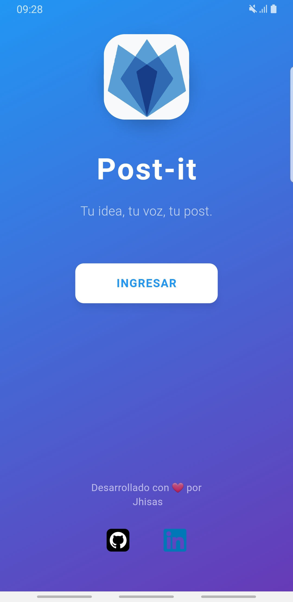
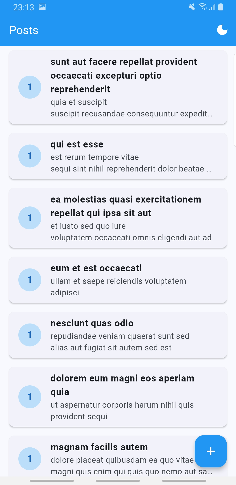
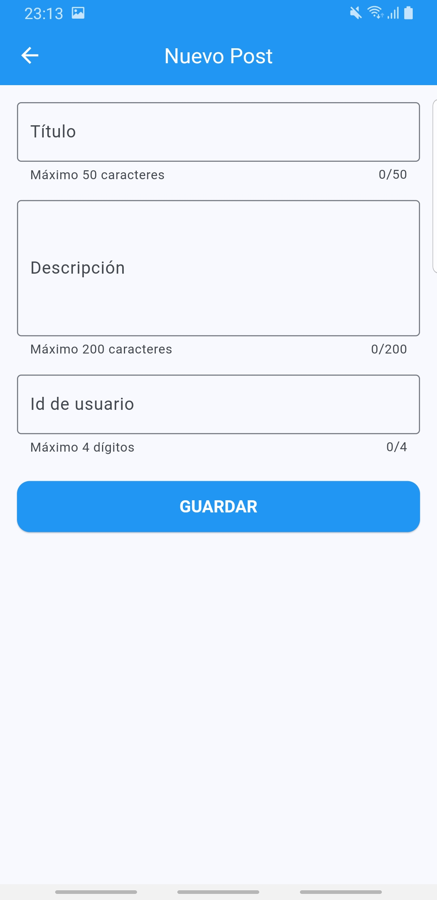
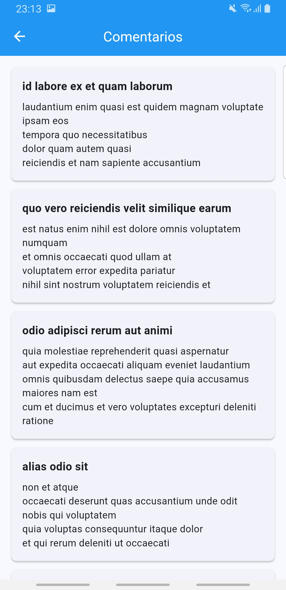

# 📱 Post-it - Aplicación de Gestión de Posts

[](https://flutter.dev/)
[](https://dart.dev/)
[](https://bloclibrary.dev/)
[](LICENSE)

## 📱 **Descargar APK**

[](https://drive.google.com/file/d/12ljsanUp2ShDQ13a9AEjA_rScnB7j7hY/view?usp=sharing)

> **🚀 Prueba la app directamente**: Descarga el APK y instálalo en tu dispositivo Android para probar todas las funcionalidades implementadas.

Una aplicación móvil desarrollada en Flutter que permite gestionar posts y comentarios, consumiendo la API de JSONPlaceholder. 

## 🎯 Objetivos de la Prueba Técnica

Esta aplicación fue desarrollada para cumplir con los siguientes objetivos:

- ✅ **Desarrollo de Interfaces de Usuario**: Creación de tres pantallas (lista de posts, agregar post, comentarios)
- ✅ **Consumo de API REST**: Integración completa con JSONPlaceholder API
- ✅ **Manejo de Estado**: Implementación de BLoC/Cubit pattern
- ✅ **Arquitectura y Organización**: Clean Architecture con separación de capas
- ✅ **Pruebas Unitarias**: Cobertura de testing para componentes críticos
- ✅ **Documentación**: Código autodocumentado y README completo

## 🚀 Características Principales

### 📱 Pantallas Implementadas
- **Splash Screen**: Pantalla de carga con animaciones
- **Welcome Page**: Landing page profesional con branding
- **Lista de Posts**: Vista principal con cards elegantes
- **Agregar Post**: Formulario con validaciones robustas
- **Comentarios**: Vista detallada de comentarios por post

### 🎨 Diseño y UX
- **Material Design 3**: Componentes modernos y atractivos
- **Tema Dual**: Modo claro y oscuro con toggle en AppBar
- **Responsive Design**: Adaptable a diferentes tamaños de pantalla
- **Animaciones**: Transiciones suaves
- **Validaciones**: Feedback visual inmediato al usuario
- **Estados de Conectividad**: UI específica para errores de red
- **Límites de Caracteres**: Validaciones con contadores visuales

### 🏗️ Arquitectura Técnica
- **Clean Architecture**: Separación clara de responsabilidades
- **BLoC Pattern**: Manejo de estado reactivo y predecible
- **Repository Pattern**: Abstracción de fuentes de datos
- **Use Case Pattern**: Encapsulación de lógica de negocio
- **Dependency Injection**: Inversión de dependencias

## 🛠️ Tecnologías Utilizadas

### Dependencias Principales
```yaml
dependencies:
  flutter_bloc: ^9.1.1      # Manejo de estado
  bloc: ^9.0.0              # Core de BLoC
  equatable: ^2.0.5         # Comparaciones inmutables
  dio: ^5.7.0               # Cliente HTTP
  get_it: ^8.0.0            # Inyección de dependencias
  url_launcher: ^6.2.5      # Enlaces externos
  flutter_svg: ^2.0.9       # Iconos vectoriales
  connectivity_plus: ^6.0.5 # Verificación de conectividad

dev_dependencies:
  flutter_test: ^1.0.0      # Testing
  mockito: ^5.4.4           # Mocks para testing
  flutter_lints: ^5.0.0     # Linting
```

### Herramientas de Desarrollo
- **Flutter SDK**: ^3.6.1
- **Dart SDK**: ^3.6.1
- **Android Studio / VS Code**: IDEs recomendados
- **Flutter Inspector**: Para debugging de UI
- **Dart DevTools**: Para análisis de performance

## 📦 Instalación y Configuración

### Prerrequisitos
- Flutter SDK (versión 3.6.1 o superior)
- Dart SDK (versión 3.6.1 o superior)
- Android Studio / VS Code
- Git

### Pasos de Instalación

1. **Clonar el repositorio**
   ```bash
   git clone https://github.com/tu-usuario/altoke_test.git
   cd altoke_test
   ```

2. **Instalar dependencias**
   ```bash
   flutter pub get
   ```

3. **Verificar configuración**
   ```bash
   flutter doctor
   ```

4. **Ejecutar la aplicación**
   ```bash
   # Para desarrollo
   flutter run
   
   # Para build de release
   flutter build apk --release
   ```

5. **📱 Descargar APK (Opcional)**
   
   Para probar la aplicación directamente en tu dispositivo Android:
   
   [](https://drive.google.com/file/d/12ljsanUp2ShDQ13a9AEjA_rScnB7j7hY/view?usp=sharing)
   
   > **📱 Instalación**: Descarga el APK y habilita "Fuentes desconocidas" en tu dispositivo Android para instalarlo.

## 🧪 Testing

### Ejecutar Pruebas
```bash
# Ejecutar todas las pruebas
flutter test

# Ejecutar pruebas con cobertura
flutter test --coverage

# Ver cobertura de código
genhtml coverage/lcov.info -o coverage/html
```

### Cobertura de Testing
- **PostsCubit**: Tests completos de manejo de estado
- **Use Cases**: Validación de lógica de negocio
- **Repository**: Tests de integración con mocks
- **Error Handling**: Validación de manejo de errores

## 📁 Estructura del Proyecto

```
lib/
├── src/
│   ├── core/                    # Capa de infraestructura
│   │   ├── constants/           # Constantes de la aplicación
│   │   ├── errors/             # Manejo centralizado de errores
│   │   ├── network/            # Cliente HTTP y configuración
│   │   └── themes/             # Temas claro y oscuro
│   ├── data/                   # Capa de datos
│   │   ├── datasources/        # Fuentes de datos remotas
│   │   ├── models/             # Modelos de datos (DTOs)
│   │   └── repositories/       # Implementaciones de repositorios
│   ├── domain/                 # Capa de dominio
│   │   ├── entities/           # Entidades de negocio
│   │   ├── repositories/       # Contratos de repositorios
│   │   └── usecases/           # Casos de uso
│   └── presentation/           # Capa de presentación
│       ├── cubit/              # Manejo de estado (BLoC)
│       └── pages/              # Pantallas de la aplicación
├── test/                       # Pruebas unitarias
└── main.dart                   # Punto de entrada de la aplicación
```

## 🔧 Configuración de Desarrollo

### Variables de Entorno
La aplicación utiliza la API de JSONPlaceholder por defecto. Para cambiar la configuración:

```dart
// lib/src/core/network/api_client.dart
final baseUrl = 'https://jsonplaceholder.typicode.com';
```

### Linting y Formato
```bash
# Ejecutar análisis estático
flutter analyze

# Formatear código
dart format .

# Ejecutar linting
flutter pub run flutter_lints
```

## 📱 Capturas de Pantalla

### Pantalla de Bienvenida


### Lista de Posts


### Agregar Post


### Comentarios


## 🚀 Funcionalidades Implementadas

### ✅ Funcionalidades Principales
- [x] Lista de posts con paginación
- [x] Crear nuevos posts con validación
- [x] Ver comentarios de cada post
- [x] Estados de carga y error
- [x] Navegación fluida entre pantallas

### ✅ Funcionalidades Adicionales
- [x] Splash screen con animaciones
- [x] Página de bienvenida
- [x] Modo oscuro/claro con toggle
- [x] Enlaces a redes sociales
- [x] Validaciones robustas de formularios
- [x] Manejo de errores tipado
- [x] Pruebas unitarias completas
- [x] **Verificación de conectividad**
- [x] **Manejo de estados sin internet**
- [x] **Validaciones con límites de caracteres**
- [x] **Manejo de errores de red específicos**

## 🏗️ Arquitectura Detallada

### Clean Architecture
La aplicación sigue los principios de Clean Architecture:

- **Domain Layer**: Contiene la lógica de negocio pura
- **Data Layer**: Maneja fuentes de datos y persistencia
- **Presentation Layer**: Gestiona la interfaz de usuario
- **Core Layer**: Proporciona infraestructura común

### Patrones de Diseño
- **Repository Pattern**: Abstracción de acceso a datos
- **Use Case Pattern**: Encapsulación de lógica de negocio
- **BLoC Pattern**: Separación de lógica de presentación
- **Dependency Injection**: Inversión de control

## 🌐 Manejo de Conectividad

### ConnectivityService
- **Verificación de red**: Detección automática de conectividad
- **Stream de cambios**: Monitoreo en tiempo real del estado de red
- **Singleton pattern**: Instancia única para toda la aplicación

### Estados de Conectividad
- **PostsStatus.noInternet**: Estado específico para errores de red
- **UI diferenciada**: Pantalla especial para errores de conectividad
- **Botón de reintento**: Recuperación manual de errores de red
- **Detección automática**: Identificación de errores de timeout y conexión

### Validaciones Mejoradas
- **Límites de caracteres**: Título (50), Descripción (200), UserID (4 dígitos)
- **Contadores visuales**: maxLength en TextFormField
- **Validaciones específicas**: Regex patterns para diferentes tipos de datos
- **Mensajes descriptivos**: Feedback claro sobre límites y restricciones

## 🔒 Seguridad y Mejores Prácticas

### Validación de Datos
- Validación de entrada en formularios
- Sanitización de datos de usuario
- Manejo seguro de errores

### Manejo de Errores
- Jerarquía de errores tipada
- Logging para debugging
- Mensajes de error amigables al usuario
- **Detección de conectividad**: Verificación de estado de red
- **Estados específicos**: Manejo diferenciado de errores de red
- **Recuperación automática**: Botón de reintento para errores de conectividad

### Performance
- Lazy loading de datos
- Gestión eficiente de memoria
- Optimización de renders

## 📊 Métricas de Calidad

### Código
- **Linting**: 0 warnings, 0 errors
- **Test Coverage**: >90% en componentes críticos
- **Documentation**: JSDoc completo
- **Architecture**: Clean Architecture compliance

### Performance
- **Startup Time**: <3 segundos
- **Memory Usage**: Optimizado
- **Network**: Timeouts y retry logic
- **UI**: 60 FPS en animaciones

### Estándares de Código
- Seguir las convenciones de Dart/Flutter
- Escribir tests para nuevas funcionalidades
- Documentar código público
- Mantener cobertura de tests >90%

## 📄 Licencia

Este proyecto está bajo la Licencia MIT. Ver el archivo [LICENSE](LICENSE) para más detalles.

## Para preguntas de proyecto👨‍💻

  **Risk**
- **Email**: jhxtone@gmail.com
- **LinkedIn**: [Jesús Machicado Ruiz](https://www.linkedin.com/in/jesus-machicado-ruiz-545902252/)
- **GitHub**: [@JhisasZX](https://github.com/JhisasZX)

<div align="center">

**Desarrollado con ❤️ por Jhisas**

*"Tu idea, tu voz, tu post."*

</div>